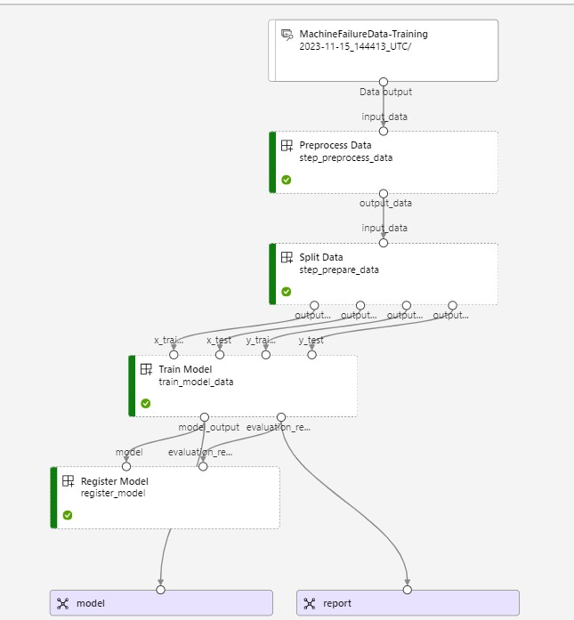
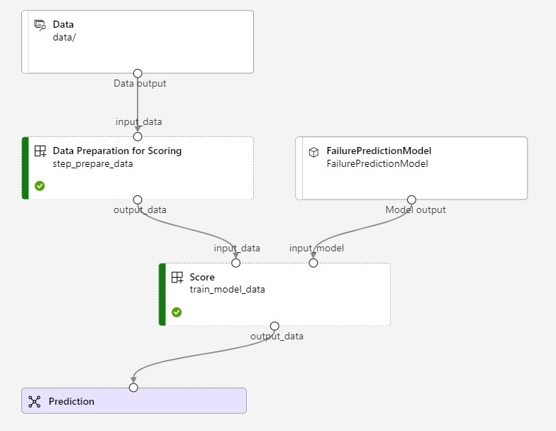

## Overview
Machine failures can lead to significant downtime and maintenance costs.
This project aims to address this issue by building an azure machine learning pipeline that allows real time training, scoring and inference of predicting machine failures in advance leading to extended equipment lifespan and overcoming the challenges related to machine downtime including Long Maintenance Waiting time & Productivity Decrease.

Anticipating machine failures leads to making informed decisions on production planning and resource allocation.
This approach empowers businesses to proactively manage maintenance, minimize downtime, and optimize operational efficiency

You can check the Evaluation & Exploratory Data Analysis on this repository:
<a>https://github.com/Hypatchia/MachineFailure-Scikitlearn-Mlflow</a>

## Built with:

 

## Azure ML Pipeline Setup

1. **Azure ML Workspace:** Set up an Azure Machine Learning workspace.
2. **Compute Resources:** Configure compute resources for training and deployment in Azure ML.
3. **Environment:** Define the environment and dependencies using Azure ML environment files.
4. **Pipeline Script:** Create scripts for building and deploying the ML pipeline.

### Getting Started with Azure ML
Follow these steps to set up the Azure ML pipeline:

1. **Azure ML Workspace:**
   - Create a new Azure ML workspace [here](https://ml.azure.com/).
   - Note your workspace name and resource group.

2. **Compute Resources:**
   - Set up Azure ML compute resources for training and deployment.
   - Update the `config.json` file with your Azure ML workspace details.

3. **Environment:**
   - Define the environment and dependencies in conda_dependencies.yml
   
4. **Define Components Script:**
   - Implement the ML pipeline in components scripts (/scipts/) while making use of config (/config/) files.
   - Use Azure ML SDK for managing the end-to-end ML workflow.

5. **Build the Pipelines**
    * For train & Evaluation in deploy-train.py
    * For Scoring on newly unseen data in deploy-score.py
5. **Execute the Azure ML Pipeline:**
   - Run the pipeline script to trigger the training and deployment processes.
   ~~~
   python deploy-train.py # For Model Training & Evaluation

   python deploy-score.py # For Model Scoring on Unseen Data
   ~~~

## Key Features
- Proactive Maintenance: Identify potential machine failures before they occur, allowing for proactive maintenance.
- Operational Efficiency: Optimize production schedules and resource allocation by minimizing unexpected downtime.
- Scalable Model Management: Utilize MLflow for efficient model tracking, versioning, and deployment.
- User-friendly Interface: Easy-to-use scripts for training models, tracking experiments & evaluating results.

## Approach
This project focuses on predicting machine failures using Random Forests, implemented with Scikit-learn.
The Machine Learning Lifecycle was managed with MLflow & Azure Machine Learning Services. 
The goal is to create a robust model that can accurately predict machine failures based on input features representing the states of the componenets of a machine.

### Pipeline Overview:

<h3 align="center">Final Training Pipeline</h3>

  

<h3 align="center">Final Scoring Pipeline</h3>

  

## Local Setup
- Clone the repository & navigate
- Install dependencies
- View Exploratory Data analysis on EDA.ipynb
- Set config.json file with your own credentials
- Trigger Azure train using:
    ~~~
    python deploy-train.py
    ~~~
- After training is successfuly completed, you can trigger scoring using:
    ~~~
    python deploy-score.py
    ~~~

## Contact:
Feel free to reach out to me on LinkedIn or through email & don't forget to visit my portfolio.
 
  
  
  

